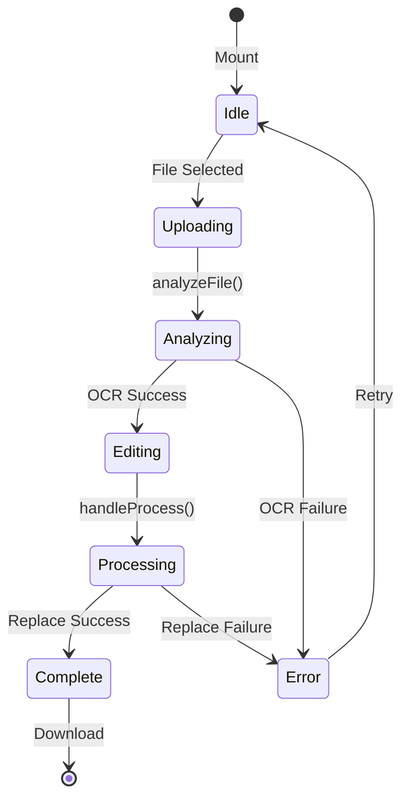

# WYSIWYG PDF Editor Architecture

**Version**: 1.1 (Production Candidate)  
**Date**: January 2026  
**Authors**: PDFLab Engineering  
**Status**: Living Document

---

## Table of Contents

1. [Overview](#overview)
2. [Goals & Non-Goals](#goals--non-goals)
3. [System Architecture](#system-architecture)
4. [Coordinate System & Scaling](#coordinate-system--scaling)
5. [Frontend Deep Dive](#frontend-deep-dive)
6. [Backend Deep Dive](#backend-deep-dive)
7. [Data Models](#data-models)
8. [Error Handling Matrix](#error-handling-matrix)
9. [Security & Data Lifecycle](#security--data-lifecycle)
10. [Performance Characteristics](#performance-characteristics)
11. [Accessibility (A11y)](#accessibility-a11y)
12. [Vendor Dependency & Risk](#vendor-dependency--risk)
13. [Known Limitations](#known-limitations)
14. [Future Roadmap](#future-roadmap)
15. [Architecture Decision Records (ADRs)](#architecture-decision-records-adrs)
16. [Incident Runbook](#incident-runbook)
17. [Code References](#code-references)
18. [Visual Component Layout](#visual-component-layout)
19. [Version History](#version-history)

---

## Overview

The WYSIWYG PDF Editor enables users to upload a PDF, automatically detect text regions via OCR, and edit text inline using positioned HTML inputs overlaid on a rendered PDF image. The modified text is then "burned in" to the PDF via a text replacement API.

**Key Insight**: We do _not_ modify the PDF structure directly in-browser. Instead, we use a "visual proxy" approach:

1. Render the PDF as a static image (canvas).
2. Overlay editable inputs at coordinates returned by OCR.
3. Send search/replace instructions to a backend service that modifies the actual PDF.

---

## Goals & Non-Goals

### Goals (In Scope)

- Enable text editing on single-page PDFs.
- Provide a visually accurate representation of editable regions.
- Ensure edits persist in a downloadable, standards-compliant PDF.

### Non-Goals (Explicitly Out of Scope)

| Feature                         | Reason                                                   |
| :------------------------------ | :------------------------------------------------------- |
| Image editing                   | Requires rasterization pipeline; MVP focuses on text.    |
| Form field editing (AcroForms)  | Different API surface; scheduled for V2.                 |
| Digital signature preservation  | Editing invalidates signatures by design.                |
| Multi-page simultaneous editing | UX complexity; single-page for MVP.                      |
| Offline editing                 | Requires local PDF manipulation library (e.g., pdf-lib). |

---

## System Architecture

```mermaid
flowchart TB
    subgraph Client [Browser - Next.js]
        A[User Uploads PDF] --> B[react-pdf Renders Canvas]
        B --> C[Overlay Layer with Inputs]
        C --> D[User Edits Text]
        D --> E[Save Changes Button]
    end

    subgraph Backend [Express Server]
        F[POST /api/edit/analyze]
        G[POST /api/edit/replace-text]
        H[multer Temp Storage]
        I[pdfco.service.ts]
    end

    subgraph Vendor [PDF.co Cloud]
        J[/pdf/convert/to/json2]
        K[/pdf/edit/replace-text]
    end

    A --> F
    F --> H
    H --> I
    I --> J
    J --> I
    I --> F
    F --> C

    E --> G
    G --> H
    H --> I
    I --> K
    K --> I
    I --> G
    G --> L[Download Link]
```

### Request Flow (Detailed)

1. **Upload Phase**: File sent as `multipart/form-data` to `/api/edit/analyze`.
2. **Analysis Phase**: Backend uploads to PDF.co, receives JSON with text coordinates.
3. **Editing Phase**: Frontend renders overlay; user modifies text in HTML inputs.
4. **Commit Phase**: Changed text pairs sent to `/api/edit/replace-text`.
5. **Download Phase**: Backend returns signed URL to modified PDF.

---

## Coordinate System & Scaling

### The 72 DPI Problem

PDF coordinates are specified in **points** (1 point = 1/72 inch). A standard US Letter page is 612 × 792 points.

`react-pdf` renders to a `<canvas>` element. The rendered pixel dimensions depend on:

- **Page dimensions** (from PDF metadata)
- **Scale factor** (our `scale` prop, default `1.0`)
- **Device pixel ratio** (for high-DPI displays)

### Coordinate Mapping Formula

```
CanvasX = (PDF_X * scale)
CanvasY = (PDF_Y * scale)
```

**Current Implementation**: We force `scale={1.0}` to maintain 1:1 mapping. This simplifies coordinate math but limits zoom functionality.

### Future Zoom Support

To support zoom:

```typescript
const renderX = pdfX * currentScale;
const renderY = pdfY * currentScale;
// Also scale width/height
```

**Risk**: If OCR coordinates are returned at a different DPI than the PDF's internal coordinate space, alignment will drift. PDF.co returns coordinates in the PDF's native point system, which is correct.

---

## Frontend Deep Dive

**File**: `app/features/pdf-editor/PdfEditorClient.tsx`

### Component Lifecycle



### State Management

| State Variable     | Type             | Purpose                               |
| :----------------- | :--------------- | :------------------------------------ |
| `file`             | `File \| null`   | The uploaded PDF blob                 |
| `ocrElements`      | `OCRElement[]`   | Mutable array of text regions         |
| `originalElements` | `OCRElement[]`   | Immutable snapshot for diff detection |
| `isAnalyzing`      | `boolean`        | Loading state for OCR phase           |
| `isProcessing`     | `boolean`        | Loading state for commit phase        |
| `resultUrl`        | `string \| null` | URL to download modified PDF          |
| `error`            | `string \| null` | User-facing error message             |

### Ghost Text Masking Algorithm

The challenge: the PDF canvas shows the _original_ text. Our overlays must completely obscure it.

**Strategy**:

```
┌──────────────────────────────────┐
│  Original PDF Text (Canvas)      │  <- Must be hidden
├──────────────────────────────────┤
│  ┌────────────────────────────┐  │
│  │  Input (White Background)  │  │  <- Expanded by 4px
│  │  offset: -2px              │  │
│  └────────────────────────────┘  │
└──────────────────────────────────┘
```

| Parameter        | Value     | Rationale                      |
| :--------------- | :-------- | :----------------------------- |
| Background       | `#FFFFFF` | Opaque mask                    |
| Width expansion  | `+4px`    | Covers anti-aliased right edge |
| Height expansion | `+4px`    | Covers ascenders/descenders    |
| X offset         | `-2px`    | Centers expansion              |
| Y offset         | `-2px`    | Centers expansion              |

**Limitation**: Fails on PDFs with colored/image backgrounds. Solution: sample canvas pixel at (x,y) and set matching background.

### Font Synthesis

PDF fonts are embedded binary resources. We cannot render them in browser. Instead, we map to web-safe equivalents:

```typescript
const getFontFamily = (pdfFont: string): string => {
  const lower = pdfFont.toLowerCase();
  if (lower.includes("times") || lower.includes("serif")) {
    return '"Times New Roman", Times, serif';
  }
  if (lower.includes("courier") || lower.includes("mono")) {
    return '"Courier New", Courier, monospace';
  }
  return "Arial, Helvetica, sans-serif";
};
```

**Known Issue**: Font weight/style is ignored. "Helvetica-Bold" renders as regular Arial.

---

## Backend Deep Dive

**Files**:

- `backend/src/controllers/pdf.editor.controller.ts`
- `backend/src/services/pdfco.service.ts`

### API Endpoints

#### `POST /api/edit/analyze`

Converts PDF to JSON with text coordinates.

**Request**:

```
Content-Type: multipart/form-data
Body: { file: <binary> }
```

**Response**:

```json
{
  "success": true,
  "data": {
    "document": {
      "page": [
        {
          "row": [
            {
              "column": [
                {
                  "text": {
                    "text": "Hello World",
                    "x": "72.00",
                    "y": "720.00",
                    "width": "150.00",
                    "height": "24.00",
                    "fontSize": "24.0",
                    "fontName": "Helvetica"
                  }
                }
              ]
            }
          ]
        }
      ]
    }
  }
}
```

#### `POST /api/edit/replace-text`

Replaces text in PDF.

**Request**:

```
Content-Type: multipart/form-data
Body: {
  file: <binary>,
  searchString: "Hello World",
  replacementString: "Hi Universe"
}
```

**Response**:

```json
{
  "success": true,
  "url": "https://pdf-temp-files.s3.amazonaws.com/..."
}
```

### PDF.co Integration Layer

The service handles:

1. **File Upload**: Streams file to PDF.co via presigned URL.
2. **API Calls**: Authenticated requests with `x-api-key` header.
3. **Response Normalization**: Handles both `body.document` and root `document` schemas.

---

## Data Models

### OCRElement (Frontend)

```typescript
interface OCRElement {
  id: string; // Ephemeral UUID (React key)
  originalText: string; // Immutable; used for search
  text: string; // Mutable; current input value
  x: number; // PDF points (float)
  y: number; // PDF points (float)
  width: number; // PDF points (float)
  height: number; // PDF points (float)
  fontSize: string; // e.g., "24.0"
  fontName: string; // e.g., "Helvetica-Bold"
}
```

### PDF.co Text Object (API Response)

```typescript
interface PdfCoTextObject {
  text: string; // The actual text content
  x: string; // X coordinate (string, needs parseFloat)
  y: string; // Y coordinate
  width: string;
  height: string;
  fontSize: string;
  fontName: string;
}
```

---

## Error Handling Matrix

| Scenario            | HTTP Code   | Frontend Behavior                       | Recovery Path           |
| :------------------ | :---------- | :-------------------------------------- | :---------------------- |
| PDF.co rate limit   | 429         | Red banner: "Service busy"              | Retry after 60s         |
| PDF.co timeout      | 504         | Red banner: "Analysis timed out"        | Retry with smaller file |
| Invalid PDF format  | 400         | Red banner: "Unsupported file"          | Upload different file   |
| Network failure     | -           | Red banner: "Connection lost"           | Auto-retry 3x           |
| No text detected    | 200 (empty) | Yellow banner: "No editable text found" | Inform user; no action  |
| Coordinate mismatch | -           | Text appears offset                     | Refresh; report bug     |

### Error Propagation

```
PDF.co Error → pdfco.service throws → controller catches →
  { success: false, error: "..." } → Frontend displays banner
```

---

## Security & Data Lifecycle

### Threat Model

| Threat                | Mitigation                                        |
| :-------------------- | :------------------------------------------------ |
| API key exposure      | Key stored in `.env`, never sent to frontend      |
| File interception     | HTTPS in transit; no storage at rest on backend   |
| Unauthorized access   | `optionalAuthMiddleware` logs guest usage         |
| PDF.co data retention | Files auto-deleted after 1 hour per vendor policy |

### File Lifecycle

```
Upload → multer temp storage → streamed to PDF.co →
  temp file deleted in finally{} block →
  PDF.co auto-deletes after 1 hour
```

**GDPR Note**: No user files are persisted. PDF.co is the data processor; review their DPA if handling PII.

---

## Performance Characteristics

| Metric                 | Value   | Notes                              |
| :--------------------- | :------ | :--------------------------------- |
| OCR latency (1 page)   | ~3-5s   | Depends on PDF.co queue            |
| OCR latency (10 pages) | ~15-25s | Linear scaling                     |
| Max file size          | 25 MB   | Backend limit; PDF.co allows 100MB |
| Overlay render time    | <100ms  | DOM-based; instant                 |
| Replace latency        | ~2-4s   | Per replacement call               |

---

## Accessibility (A11y)

### Current Status: Partial Compliance

| Requirement          | Status | Notes                     |
| :------------------- | :----- | :------------------------ |
| Keyboard navigation  | ✅     | Tab between inputs works  |
| Screen reader labels | ⚠️     | Inputs lack `aria-label`  |
| Focus indicators     | ✅     | Ring on focus             |
| Color contrast       | ⚠️     | White-on-white edge cases |

**TODO**: Add `aria-label={`Edit text: ${el.originalText}`}` to each input.

---

## Vendor Dependency & Risk

### PDF.co Lock-in Assessment

| Factor          | Risk Level | Mitigation                         |
| :-------------- | :--------- | :--------------------------------- |
| API surface     | Medium     | Abstract behind `pdfco.service.ts` |
| Pricing changes | High       | Monitor usage; budget alerts       |
| Service outage  | High       | No fallback; feature offline       |
| Schema changes  | Medium     | Version pin API; monitor changelog |

### Alternative Vendors

- **Adobe PDF Services**: Higher cost; enterprise-grade.
- **pdf-lib (OSS)**: No OCR; requires different architecture.
- **Tesseract.js**: Client-side OCR; slower but vendor-free.

---

## Known Limitations

| Limitation             | Impact                                    | Planned Fix                 |
| :--------------------- | :---------------------------------------- | :-------------------------- |
| Single page only       | Users can't edit page 2+                  | V1.1: Multi-page UI         |
| Font weight ignored    | Bold text renders as regular              | V1.2: Font metrics parsing  |
| White backgrounds only | Colored PDFs show mask borders            | V1.2: Canvas pixel sampling |
| One edit at a time     | Multiple edits require multiple API calls | V1.1: Batch replacement API |

---

## Future Roadmap

### V1.1 (Q1 2026)

- [ ] Multi-page support
- [ ] Batch text replacement (single API call)
- [ ] Error retry with exponential backoff

### V1.2 (Q2 2026)

- [ ] Background color sampling
- [ ] Font weight/style detection
- [ ] Zoom controls with coordinate scaling

### V2.0 (Q3 2026)

- [ ] Form field editing (AcroForms)
- [ ] Offline mode with pdf-lib
- [ ] Collaborative editing (WebSocket sync)

---

## Architecture Decision Records (ADRs)

### ADR-001: Choice of PDF.co as OCR/Edit Vendor

**Status**: Accepted  
**Date**: 2025-11  
**Context**: We needed a cloud API that provides both OCR-to-JSON and text replacement capabilities without requiring local PDF parsing libraries.

**Options Considered**:
| Option | Pros | Cons |
|:-------|:-----|:-----|
| **PDF.co** | Fast integration, combined OCR+edit API | Vendor lock-in, usage-based pricing |
| **Adobe PDF Services** | Enterprise reliability | High cost ($0.05/page), complex SDK |
| **Tesseract.js + pdf-lib** | OSS, no vendor dependency | Slow client-side OCR, no direct text replace |
| **AWS Textract** | Scalable | No text replacement; would need pdf-lib for edits |

**Decision**: PDF.co selected for fastest time-to-market. Abstracted behind service layer for future swap.

**Consequences**:

- Positive: MVP shipped in 2 weeks.
- Negative: Runtime cost scales with usage; need monitoring.

---

### ADR-002: Overlay-Based Editing vs. Direct PDF Manipulation

**Status**: Accepted  
**Date**: 2025-11  
**Context**: Should we render editable PDF content natively or use an overlay approach?

**Options Considered**:
| Option | Pros | Cons |
|:-------|:-----|:-----|
| **Canvas overlay (chosen)** | Simple, works with any PDF | Ghost text issue, alignment challenges |
| **pdf-lib in-browser** | True WYSIWYG, offline capable | Complex font handling, no native OCR |
| **WebAssembly PDF engine** | Fastest rendering | Massive bundle size, limited browser support |

**Decision**: Canvas overlay with HTML inputs. Simpler implementation; ghost text mitigated with masking.

**Consequences**:

- Positive: Easy to implement accessible inputs.
- Negative: Requires masking strategy; can't handle rotated text.

---

### ADR-003: Single-Page MVP Scope

**Status**: Accepted  
**Date**: 2025-12  
**Context**: Multi-page editing significantly increases complexity.

**Decision**: Limit V1.0 to Page 1 only. Multi-page deferred to V1.1.

**Rationale**:

- Reduces state management complexity.
- Avoids pagination UI decisions.
- Allows faster validation of core editing UX.

---

## Incident Runbook

### Scenario 1: PDF.co API Unavailable (5xx Errors)

**Symptoms**: Users see "Analysis timed out" or "Failed to analyze" errors.

**Diagnosis**:

```bash
# Check PDF.co status page
curl https://status.pdf.co

# Check backend logs
tail -f /var/log/pdflab/backend.log | grep "PDF.co"
```

**Resolution**:

1. Confirm PDF.co outage on their status page.
2. If confirmed, enable maintenance banner on frontend.
3. Monitor for recovery; no action needed on our side.

**Escalation**: If outage > 1 hour, notify users via email.

---

### Scenario 2: Coordinate Drift (Text Appears Offset)

**Symptoms**: Overlay inputs don't align with PDF text.

**Diagnosis**:

1. Check if user has browser zoom != 100%.
2. Check `scale` prop in `PdfEditorClient.tsx` (should be `1.0`).
3. Verify PDF.co returned correct coordinates (check browser console).

**Resolution**:

1. Instruct user to reset browser zoom to 100%.
2. If issue persists, check for CSS that affects transform origin.

---

### Scenario 3: No Text Detected

**Symptoms**: PDF loads but no editable inputs appear.

**Diagnosis**:

1. Is the PDF image-based (scanned document)? OCR may fail.
2. Check console for `ocrElements` array—is it empty?
3. Check PDF.co response in Network tab.

**Resolution**:

1. If scanned PDF: inform user that scanned documents have limited support.
2. If text PDF with no results: escalate to PDF.co support.

---

## Code References

Quick links to implementation files with key line ranges:

### Frontend

| Component           | File                                                                                                                               | Lines   | Purpose                        |
| :------------------ | :--------------------------------------------------------------------------------------------------------------------------------- | :------ | :----------------------------- |
| Main Editor         | [PdfEditorClient.tsx](file:///c:/Users/Mac/OneDrive/Desktop/Projects/PDFLab/app/features/pdf-editor/PdfEditorClient.tsx)           | 1-346   | Complete editor component      |
| OCR Parsing         | [PdfEditorClient.tsx](file:///c:/Users/Mac/OneDrive/Desktop/Projects/PDFLab/app/features/pdf-editor/PdfEditorClient.tsx#L44-L109)  | 44-109  | `analyzeFile()` function       |
| Text Overlay Render | [PdfEditorClient.tsx](file:///c:/Users/Mac/OneDrive/Desktop/Projects/PDFLab/app/features/pdf-editor/PdfEditorClient.tsx#L286-L332) | 286-332 | Overlay loop with masking      |
| API Client          | [api.ts](file:///c:/Users/Mac/OneDrive/Desktop/Projects/PDFLab/lib/api.ts#L933-L980)                                               | 933-980 | `analyzePdf`, `replacePdfText` |

### Backend

| Component      | File                                                                                                                               | Lines | Purpose               |
| :------------- | :--------------------------------------------------------------------------------------------------------------------------------- | :---- | :-------------------- |
| Controller     | [pdf.editor.controller.ts](file:///c:/Users/Mac/OneDrive/Desktop/Projects/PDFLab/backend/src/controllers/pdf.editor.controller.ts) | Full  | Request handlers      |
| PDF.co Service | [pdfco.service.ts](file:///c:/Users/Mac/OneDrive/Desktop/Projects/PDFLab/backend/src/services/pdfco.service.ts)                    | Full  | Vendor integration    |
| Routes         | [pdf.editor.routes.ts](file:///c:/Users/Mac/OneDrive/Desktop/Projects/PDFLab/backend/src/routes/pdf.editor.routes.ts)              | Full  | Endpoint registration |

---

## Visual Component Layout

The overlay system uses absolute positioning within a relative container:

```
┌─────────────────────────────────────────────────────────────┐
│  <div className="relative"> (containerRef)                  │
│  ┌───────────────────────────────────────────────────────┐  │
│  │  <Document> → <Page> (react-pdf canvas)               │  │
│  │  ┌─────────────────────────────────────────────────┐  │  │
│  │  │                                                 │  │  │
│  │  │     [PDF Page Rendered as Canvas Image]         │  │  │
│  │  │                                                 │  │  │
│  │  └─────────────────────────────────────────────────┘  │  │
│  └───────────────────────────────────────────────────────┘  │
│  ┌───────────────────────────────────────────────────────┐  │
│  │  <div className="absolute inset-0"> (Overlay Layer)   │  │
│  │                                                       │  │
│  │  ┌──────────────┐  ┌──────────────┐  ┌──────────────┐ │  │
│  │  │ <input>      │  │ <input>      │  │ <input>      │ │  │
│  │  │ x:72 y:700   │  │ x:200 y:700  │  │ x:72 y:650   │ │  │
│  │  │ bg:white     │  │ bg:white     │  │ bg:white     │ │  │
│  │  └──────────────┘  └──────────────┘  └──────────────┘ │  │
│  │                                                       │  │
│  └───────────────────────────────────────────────────────┘  │
└─────────────────────────────────────────────────────────────┘
```

**Key CSS Properties**:

- Container: `position: relative`
- Overlay div: `position: absolute; inset: 0; pointer-events: none`
- Each input wrapper: `pointer-events: auto` (re-enables interaction)
- Input position: `transform: translate(${x}px, ${y}px)`

---

## Version History

| Version | Date       | Author      | Changes                                                       |
| :------ | :--------- | :---------- | :------------------------------------------------------------ |
| 1.0     | 2026-01-12 | Engineering | Initial MVP documentation                                     |
| 1.1     | 2026-01-12 | Engineering | Added security, error handling, performance, a11y sections    |
| 1.2     | 2026-01-12 | Engineering | Added ADRs, Runbook, Code References, Visual Component Layout |
